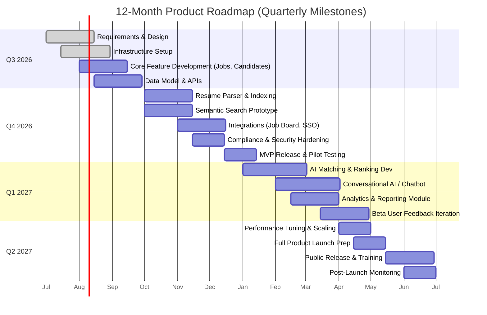

# AI-Native Cloud Applicant Tracking System (ATS): Product Requirements & Roadmap

**Executive Summary:** We propose an AI-native, multi-tenant cloud ATS that natively embeds machine intelligence into every workflow, improving time-to-hire and quality-of-hire. Leading tools report dramatic gains: e.g. Beamery cites a *30% reduction* in time-to-hire and AI-based platforms can cut time-to-fill by *40–50%*. Our AI-ATS will serve recruiters, candidates and hiring managers by automating sourcing, screening, outreach, and scheduling, while ensuring compliance (GDPR, EEOC, CCPA) and security (encryption, RBAC, audit logs). Compared to bolt-on AI solutions, a truly native design (per Yena.ai) grants the AI *live data access*, continuous learning, and agentic workflows. We will map all core and AI features, technical architecture, and roadmap milestones in detail.

## Personas  
- **Recruiters / Sourcers:** Seek efficiency in finding and engaging qualified candidates. They need rich candidate profiles, intelligent matching, pipeline management, and automated outreach to scale. (e.g. hireEZ and SeekOut emphasize “discover and engage top talent efficiently” with AI.)  
- **Candidates:** Expect a smooth application experience, timely updates, privacy guarantees, and fair evaluation. AI can personalize communication (chatbots or emails) and speed feedback, while compliance (e.g. GDPR “right to be forgotten”) protects their data.  
- **Hiring Managers (Organizations):** Require accurate shortlists, transparent decision support, and easy collaboration. They benefit from AI-curated candidate lists and scheduling assistance. SmartRecruiters’ Winston Companion for managers (in Slack/Teams) “summarises candidates and handles scheduling” without extra login, illustrating this need.

## Inputs and Outputs  
- **Inputs:** Candidate profiles and resumes from sources (career sites, LinkedIn, job boards, internal CRM, recruiter submissions), job postings and requisitions from organizations, recruiter notes/ratings, and historical hiring data.  
- **Outputs:** Ranked candidate shortlists, interview schedules (calendar invites, reminders), analytics dashboards (pipeline metrics, diversity/compliance reports), and integrations (pushing candidates to HRIS/offer modules, posting jobs externally). For example, our system will auto-generate interview scorecards and transcriptions, forecast offer acceptance, and provide compliance logs for audits.  

## Feature Set (Core vs AI)  

| **Feature**             | **Type** | **Purpose**                             | **Acceptance Criteria**                                     | **Data Needs**                        | **Privacy Impact**                        | **Perf. Target**                               | **Failure Modes**                                               |
|-------------------------|----------|-----------------------------------------|-------------------------------------------------------------|---------------------------------------|-------------------------------------------|-------------------------------------------------|-----------------------------------------------------------------|
| **Job & Requisition Management** | Core    | Central repository for open roles; define workflows. | Create/edit job, set requirements, custom stages, permissions for roles. | Job descriptions, requisition fields.   | Low (no sensitive PII).                 | Page load <200ms; CRUD ops <100ms.             | Missing jobs; incorrect workflows; data loss.                    |
| **Applicant Tracking & Pipeline**  | Core    | Track applicants through stages. | Move candidates across stages, real-time updates, notifications. | Candidate records, stage definitions. | Moderate (candidates’ PII stored).    | Stage changes <1s; notifications <15s.         | Lost updates, out-of-sync pipelines.                             |
| **Candidate Database & Search** | Core/AI | Store profiles; enable search by skills/experience. | Boolean/semantic search returns relevant results. | Indexed resumes, profiles.             | Candidate consent needed for stored CVs. | Query latency <200ms for text search; <500ms for semantic search. | Irrelevant results, missed matches.                              |
| **Resume Parsing & Extraction** | AI      | Auto-extract structured data (names, skills) from CVs. | Parsed fields (education, skills) match input 95% accuracy. | Resume documents (PDF/text).          | High (extracts personal data from PII); need consent. | Parsing <2s per resume.                          | Mis-parsed fields, missing skills, format errors.                |
| **Candidate Matching & Ranking** | AI      | Semantic match candidates to jobs (e.g. embeddings). | Top candidates (e.g. 5) score above threshold relevance. | Job descriptions, candidate embeddings. | Moderate (scores are derivative, not sensitive) | Rank generation <1s; 90% coverage of potential fit. | Over-ranking weak candidates or missing good ones.              |
| **Talent Rediscovery** | AI      | Surface past applicants or passive candidates for new roles. | Reactivation recommendations match requirements. | Historical applicant data, CRM notes. | Moderate (contains PII from past apps). | Query <300ms for suggestion lists.            | Recommends irrelevant past candidates.                           |
| **Automated Screening (Conversational)** | AI      | Screen candidates via chatbot or form (e.g. Winston Screen). | Auto-answers collected; scoring consistent with human review. | Job-specific questions; candidate responses. | High (candidate responses are PII).    | Chat/screen interaction latency <500ms.        | Misinterpreted answers, low engagement.                          |
| **Interview Scheduling** | Core/AI | Coordinate calendars (AI-assisted). | Sync recruiter and candidate calendars; invite sent with correct time-zone. | Recruiter schedules, candidate availabilities. | Low (calendars not PII).          | Meet-time found in <5s; confirmation email <1m. | Double bookings, timezone errors.                                |
| **Interview Transcription & Summarization** | AI      | Transcribe audio/video interviews and summarise key points. | Transcription accuracy >85%; summaries coherent. | Recorded interview audio.            | Moderate (interview PII).         | Transcription <1× length; summary <30s.      | Bad transcription (noise), incoherent summary.                   |
| **Interview Question Generation** | AI      | Generate role-relevant questions (e.g. from JD). | Questions are relevant and balanced across skills. | Job description, skill ontology.     | Low (no PII).                     | Generate <2s.                                | Irrelevant or biased questions.                                 |
| **Communication & Outreach** | Core/AI | Email templates; AI-personalised messaging. | System sends bulk/personalized emails, tracks opens. | Candidate contacts, template DB, AI model. | High (uses candidate profiles).    | Email send <1m; personalization <1s.         | Spam flags, irrelevant content.                                  |
| **Analytics & Reporting** | Core    | Provide dashboards and compliance reports. | Reports for funnel metrics, diversity/EQUAL metrics. | Aggregated application data, EEOC fields. | Low (aggregated data).          | Dashboard <500ms; export <10s.             | Misreported metrics, compliance gaps.                            |
| **Integrations (APIs/Webhooks)** | Core    | Connect to job boards, LinkedIn, SSO, HRIS, email, calendar. | Data sync works both ways (e.g. job post pushed). | External API credentials/data.       | High (data sharing with 3rd parties). | API calls <200ms.                           | Sync failures, stale data.                                       |
| **Security & RBAC** | Core    | Role-based access, audit trails. | Permissions enforce data segregation (e.g. region). | User roles, auth credentials.         | High (protects all data).       | AuthN latency <100ms.                        | Unauthorized access, permission leaks.                           |
| **Data Retention & Consent** | Core    | Manage candidate consents and retention schedules. | Can purge data on request (GDPR “right to be forgotten”). | Consent flags per candidate.         | High (manages deletion of PII). | Deletion <24h of request.                    | Stale data, failure to delete.                                   |
| **Salary Prediction** | AI      | Estimate candidate salary from profile. | Predicted salary within industry benchmark ±10%. | Market salary data, candidate experience. | Medium (salary is semi-sensitive). | Prediction <100ms.                          | Gross under/overestimate, market shifts.                         |
| **Bias Detection & Mitigation** | AI      | Detect and correct systemic biases (gender, race). | Reports disparities (e.g. % candidates by group) and adjusts model. | Protected attributes (if collected), model outputs. | High (handles sensitive PII).     | Bias checks every cycle (<monthly).         | Biased recommendations, non-compliance.                          |
| **Explainability** | AI      | Provide rationale for AI decisions (SHAP/LIME). | Feature-level explanations accompany each score. | Model features, inference data.      | Low (no PII).                   | Explanation in <2s.                         | Opaque outputs, misinterpretation.                               |

*Note: The table above is illustrative. Each feature will have detailed acceptance tests (e.g. recognition accuracy thresholds), data quality requirements (e.g. normalized resumes), and privacy safeguards (encryption, consent). E.g. Greenhouse anonymizes resumes to blur PII; SmartRecruiters’ Winston is “GDPR-aligned, explainable, and supports complex role-based permissions”; Lever uses IBM WatsonX governance for “always-on fairness, transparency”.*

## Data Model (ER Diagram)  
We anticipate entities: **Organization**, **Recruiter**, **Job**, **Candidate**, **Application**, and **ActivityLog**. For example, each *Organization* posts many *Jobs* and employs many *Recruiters*; each *Candidate* can submit many *Applications* to Jobs; actions (emails sent, stages changed) are logged in *ActivityLog*. A simplified ER diagram (key fields) follows:

```mermaid
erDiagram
    ORGANIZATION ||--|{ RECRUITER : employs
    ORGANIZATION ||--|{ JOB : posts
    CANDIDATE ||--|{ APPLICATION : applies_for
    JOB ||--|{ APPLICATION : receives
    RECRUITER ||--|{ ACTIVITY_LOG : performs
    CANDIDATE ||--|{ ACTIVITY_LOG : experiences
    JOB ||--|{ ACTIVITY_LOG : logs
    ORGANIZATION {
        int id PK
        string name
        string region
    }
    RECRUITER {
        int id PK
        string name
        string email
        int organization_id FK
        string role
    }
    CANDIDATE {
        int id PK
        string name
        string email
        string phone
        string resume (PDF/blob)
        json profile_data
    }
    JOB {
        int id PK
        string title
        string description
        int organization_id FK
        string location
        date posted_date
    }
    APPLICATION {
        int id PK
        int candidate_id FK
        int job_id FK
        string status
        date applied_date
    }
    ACTIVITY_LOG {
        int id PK
        datetime timestamp
        string action
        int recruiter_id FK
        int candidate_id FK
        int job_id FK
        string details
    }
```

## Technical Architecture  
We will deploy on a public cloud (AWS/Azure/GCP unspecified), using containerized microservices for scalability. A high-level architecture is: recruiter and candidate UIs connect via an **API Gateway** to the ATS core. The ATS core services include: user/auth (SSO, RBAC), pipeline/workflow engine, search/index service, and ML/AI engines. Data is stored in a multi-tenant **cloud database** (e.g. Postgres) and a search index (e.g. Elasticsearch or vector DB) for fast semantic queries. ML models (for parsing, matching, etc.) run in dedicated inference services, with data pipelines for training. Integrations (job boards, HRIS, email, calendars) are handled by a middleware layer.

```mermaid
flowchart LR
  subgraph CloudATS
    APIGW[API Gateway]
    Auth[Auth & RBAC]
    Core[ATS Core Services]
    DB[(Database)]
    Search[Search / Index]
    ML[ML/AI Services]
    Scheduler[Scheduling Service]
    Integrations[Integration Layer]
    Logging[Audit & Logging]
  end

  subgraph Users
    RecruiterUI[Recruiter Portal]
    HiringMgrUI[Hiring Manager Portal]
    CandidatePortal[Candidate Portal (app/chat)]
    ExternalSystem[External Tools (HRIS, Email, SSO, Job Boards)]
  end

  RecruiterUI --> APIGW
  HiringMgrUI --> APIGW
  CandidatePortal --> APIGW
  APIGW --> Auth
  APIGW --> Core
  Core --> DB
  Core --> Search
  Core --> ML
  Core --> Scheduler
  Core --> Logging
  Core --> Integrations
  Auth --> Logging
  ExternalSystem --> Integrations
  Integrations --> Core
```

- **Cloud Deployment & Multi-tenancy:** All services are stateless where possible. Each tenant’s data is logically isolated via tenant ID in shared tables. Load will be balanced via auto-scaling groups.  
- **APIs:** Provide RESTful/GraphQL APIs for integration; support webhooks for triggers (e.g. “application created”). API latency targets ~100–200ms.  
- **Data Storage & Indexing:** Use a relational DB for core entities; use an inverted/semantic index (like Elasticsearch or vector DB) for candidate/job search. Candidate-parsed skills and embeddings are indexed.  
- **ML Infrastructure:** Models (NLP parsers, ranking, chatbots) are containerized (e.g. on Kubernetes or serverless). A training pipeline (on GPU instances or managed ML service) regularly retrains models on anonymized training data. Model versions are logged.  
- **Monitoring:** Central logging (ELK/Prometheus). ML performance is tracked (accuracy, drift); system metrics (latency, errors) have alerts. All features audit actions (e.g. who viewed which resume).  
- **Scalability & Latency:** We target <200ms responses for lookups/search, and <2s for heavy tasks (embedding match, parse). Services scale on demand (e.g. auto-scale ML workers). Resilience via retries and circuit breakers.  

This architecture embodies an **AI-native** design: the AI components have direct access to live data and can initiate actions (e.g. suggest a candidate match triggers a pipeline update) rather than being a sidecar module. For example, as soon as a recruiter advances a candidate, that event feeds back into the matching model for continuous learning.  

## Machine Learning & AI Components  

### Resume Parsing & Entity Extraction  
- **Model:** Likely a fine-tuned NER model (e.g. BERT or spaCy) to tag names, education, skills. Alternatively a rule+ML hybrid.  
- **Training Data:** Labeled resume datasets (diverse formats, languages) and job taxonomies. Include international CVs.  
- **Metrics:** Entity-level F1 score (target > 90%), field matching accuracy.  
- **Fairness:** Audit on gender/racial terms (ensure parser isn’t biased by names). Possibly anonymize training data.  
- **Retraining:** Bi-annual or when new resume formats appear.  

### Skill Extraction  
- **Model:** NLP classifier or embedding clustering to detect skills/keywords from free text. Could use BERT-based classifier or GPT to identify phrases.  
- **Data:** Skill lexicons (O*NET, company data), labeled resumes.  
- **Metrics:** Precision/Recall on skill mention extraction.  
- **Fairness:** Skills detection should be unbiased; vet against slang or non-standard terms.  

### Semantic Search / Candidate Matching  
- **Model:** Sentence-transformers (e.g. SBERT) or a dual-encoder for candidate CV and JD to compute cosine similarity.  
- **Data:** Corpus of past JD-Candidate matches, positive hires, rejection examples. Possibly external job/candidate embeddings.  
- **Metrics:** Ranking NDCG or RBO vs human shortlist. (Resume2Vec showed 15%+ NDCG gains.) Also precision@K of top recommended candidates.  
- **Fairness:** Monitor demographic distribution in top results. Use fair-ranking algorithms if needed.  
- **Retraining:** Quarterly, or more frequently if job market shifts.  

### Candidate Ranking/Scoring  
- **Model:** Gradient boosting or neural ranker using features from resume match score, recruiter feedback, interview results. Could use learning-to-rank frameworks (LambdaMART).  
- **Data:** Historical hiring data (CVs, outcomes, interview scores).  
- **Metrics:** Accuracy of hire prediction, ROC-AUC, calibration.  
- **Fairness:** Ensure scoring does not correlate with protected traits. Use audit frameworks (e.g. Warden AI). Greenhouse audits its talent matcher monthly.  
- **Retraining:** After every major hiring cycle or quarterly.  

### Bias Detection & Mitigation  
- **Model/Approach:** Regular audits (compare selection rates by gender/race). Use adversarial debiasing or reweighting if needed. Follow fairness guidelines.  
- **Metrics:** Statistical parity difference, equal opportunity difference.  
- **Mitigation:** Alert recruiters to biases; allow manual review overrides. E.g. Greenhouse stops training on demographic data and uses structured hiring to limit bias.  
- **Frequency:** Automated bias audit monthly.  

### Explainability  
- **Approach:** Use SHAP values or attention visualizations for model outputs.  
- **Data:** Model features and predictions.  
- **Criteria:** Every AI score accompanies key feature contributions.  
- **Use:** Recruiters can query “Why was this candidate ranked high?”; a SHAP-based dashboard shows attributes.  

### Conversational AI (Chatbots, Scheduling)  
- **Model:** Large Language Models (GPT-4 style) for candidate Q&A; intent classification for interview pre-screen.  
- **Data:** Historical chat logs, FAQs, brand voice guidelines.  
- **Metrics:** Candidate satisfaction, reduction in manual replies. SmartRecruiters reports doubling candidate conversion with AI chat.  
- **Risks:** GPT must be controlled to avoid unsafe/autonomous answers. Use a controlled domain with guardrails.  

### Interview Question Generation and Summarization  
- **Model:** LLM prompt-based generation (fine-tuned GPT/Flan-BERT) to create role-specific questions. Summarization with BART/Pegasus on transcribed text.  
- **Data:** Question banks, past interviews, competency frameworks.  
- **Metrics:** Human evaluation of relevance. For summarization, ROUGE or human reviewer rating.  
- **Performance:** Should generate in <3s.  

### Salary Prediction (Optional)  
- **Model:** Regression (XGBoost) on past candidate/job data, adjusting for location and experience.  
- **Data:** Glassdoor/market salary data + internal hires.  
- **Metrics:** Mean absolute error (target <10% MAPE).  
- **Use:** Aid recruiters by suggesting salary ranges for offers.  

Each AI component will be versioned and monitored: e.g. drift in parsing accuracy or ranking performance triggers retraining. Fairness checks and explainability are embedded by design, following the responsible AI principles espoused by Greenhouse (e.g. “If AI can’t explain itself, it doesn’t belong in hiring”).

## Integrations & APIs  
Key integrations include:  
- **Job Boards & Social:** API connections to post jobs (e.g. Indeed, LinkedIn, Google Jobs, niche boards).  
- **CRM/ATS Sync:** Bi-directional sync with HRIS/ATS (Workday, SAP SuccessFactors) for candidate data and requisitions.  
- **Communication:** SMTP for email; API to Slack/Teams for notifications; candidate SMS gateways.  
- **Calendar:** Connect Google/Office365 calendars for scheduling (OAuth).  
- **SSO:** Support SAML/OAuth (Okta, Azure AD) for organizational logins.  
- **Webhooks:** Notify external systems on events (e.g. candidate advance, new hire).  
- **API Patterns:** RESTful endpoints for CRUD operations (candidates, jobs, apps). Real-time webhooks for event-driven updates.  
All connectors will use secure OAuth tokens. For example, HireEZ offers webhooks to sync AI-screening scores into an ATS (Skima.ai reference), and Greenhouse APIs allow pipeline updates. Our platform will similarly expose APIs for integrations, with throttling and monitoring.  

## Security, Compliance & Privacy  
- **Data Encryption:** TLS 1.2+ in transit and AES-256 at rest. SOC 2 Type II certification for infrastructure (as Lever confirms for trust). Regular pen-testing and vulnerability scans.  
- **Authentication & Access:** Role-Based Access Control (RBAC) ensures recruiters see only their candidates/org data. SSO integration for user management.  
- **Audit Logging:** Immutable logs of user actions and AI decisions (who changed a status, which AI recommendations were applied). Essential for GDPR and EEOC audits.  
- **Privacy by Design:** Comply with GDPR and CCPA: candidates can download or delete their data on demand (“right to be forgotten”). Consent management is built-in: candidates opt-in to data use at application. Greenhouse exemplifies this approach with explicit toggles and no training on personal data.  
- **Fair Hiring Compliance:** Support EEOC reporting (demographic fields for lawful monitoring), and comply with NYC Local Law 144 and EU AI Act requirements (as Greenhouse highlights compliance with NYC, Colorado and EU laws). Monthly bias audits ensure non-discrimination.  
- **Data Retention Policies:** Default retention (e.g. 3 years) with automated deletion, adjustable per tenant. Candidates’ rights (access, rectification, erasure) are facilitated through self-service and admin tools.  

Compliance must be a core design driver: e.g. Greenhouse’s ISO/AI certifications set a high bar. We will align with these standards (ISO 27001, 27701, 42001) and provide customers audit reports on demand. Data residency (region-specific storage) is configurable for global clients.

## Roadmap & Milestones  



- **Milestones:** Each quarter ends with a deliverable (MVP pilot in Q4; Beta in Q1; GA release in Q2 2027).  
- **MVP Scope:** By end of Q4 2026, support core ATS (jobs, pipeline, basic search, scheduling) + a basic AI parser and match tool. Advanced AI (chatbot, ranking) will be Beta in Q1 2027.  
- **KPIs:** Initial targets might include *30% faster screening* (by AI parsing/matching) and *50% increase* in recruiter productivity (fewer manual tasks). Early customer feedback and usage metrics will guide refinements. Post-launch we will track time-to-fill, interview-to-hire ratios, user satisfaction (NPS), and accuracy of AI scores (compared to recruiter ratings).  
- **Resource Assumptions:** We assume a cross-functional team (product, dev, data science, QA, security) but leave exact staffing unspecified. MVP requires ~6–9 months of core dev.  
- **Additional Deliverables:** Documentation of APIs, model docs (for explainability), compliance reports, and an admin analytics portal.  

## Competitive Analysis  

| **Feature / Capability**        | **SeekOut** | **hireEZ** | **Beamery** | **SmartRecruiters** | **Greenhouse** | **Lever** | **Gaps / Opportunities**                    |
|---------------------------------|-------------|------------|-------------|---------------------|---------------|-----------|---------------------------------------------|
| **Candidate Sourcing & Search** | ✓ (AI search, Smart Match) | ✓ (multi-site search, candidate pools) | ✓ (skill-based pools) | Limited (focuses ATS workflows) | Basic (keyword) | Limited (basic CRM) | **Opportunity:** Integrated ATS+AI vs standalone sourcing. |
| **Resume Parsing/Profiling**    | No (tool is sourcing-focused) | ✓ (integrated parsing) | ✓ (AI-inferred skills) | Basic (form-based) | ✓ (patented anonymized parser) | Basic | Differentiator: high-accuracy, multi-language parser. |
| **Candidate Matching/Ranking**  | ✓ (AI Matching by JD) | ✓ (Applicant Review AI-match) | ✓ (AI-assisted matching) | ✓ (Winston Match multi-model scoring) | ✓ (Talent Matching with audits) | ✓ (AI screening signals) | **Opportunity:** Explainable AI ranking and continuous learning. |
| **Recruiter Productivity CRM**  | Basic (Talent pool CRM) | ✓ (Talent CRM, ATS overlay) | ✓ (built as CRM) | ✓ (ATS+CRM unified) | ✓ (ATS+CRM) | ✓ (ATS+CRM) | All have CRM elements. Opportunity: deeper pipeline intelligence (suggest next steps). |
| **Outreach Automation**         | ✓ (email personalization suggestions) | ✓ (automated campaigns) | ✓ (campaigns, nurture) | ✓ (Text recruiting) | Limited (email templates) | Limited (uses integrations) | **Opportunity:** Highly personalized AI-driven outreach (GPT-based) with efficiency. |
| **Interview Scheduling/Coord.** | Int (via Calendly) | ✓ (AI Scheduler) | Add-on (WFM not core) | ✓ (Dynamic scheduling in Winston) | Integrations | Integrations | More AI: e.g. AI-suggested interview slots, conflict resolution. |
| **Interview Intelligence**      | No | ✓ (Conversational AI interviewer) | No | ✓ (Winston Screen, Companion) | ✓ (automated transcription & summaries) | ✓ (AI transcripts & summaries) | Ensure native integration (e.g. video+AI convo) vs separate tools. |
| **Bias Mitigation & Fairness**  | Not explicit | Not explicit | Emphasis on ethical AI | Limited disclosure | ✓ (anonymization, bias audits) | IBM-gov via partner | **Gap:** Full transparency/audit capabilities are rare; an opportunity to lead in fairness reporting. |
| **Compliance & Security**       | ISO audited | ISO compliant | ✓ (compliance focus) | ✓ (GDPR-aligned, high security) | ✓ (ISO27001/42001, legal compliance) | ✓ (SOC2) | All meet basic standards. Opportunities: built-in AI governance console (toggle on/off like GH) and real-time audit alerts. |
| **Analytics & Insights**        | Basic reports | ✓ (recruiting analytics) | ✓ (Workforce intelligence) | ✓ (embedded analytics) | ✓ (AI reporting filters) | ✓ (advanced reporting) | Opportunity: A unified AI Control Center (cf. SmartOS) for customizable metrics. |

*Sources:* Competition data drawn from vendor docs. For example, SmartRecruiters touts a “real-time AI recruiting companion built on LLMs” (Winston) that doubles conversion rates. Greenhouse emphasizes structured hiring and compliance (e.g. “resume anonymization” and monthly bias audits). Lever highlights unified ATS/CRM with AI screening and fraud detection. Gaps noted above represent where our product can differentiate (e.g. fully native AI automations, rigorous fairness controls).

## Risk Assessment & Mitigation  

- **Data Privacy & Consent:** *Risk:* Storing resumes and personal data. *Mitigation:* Strict consent capture on candidate forms, encryption in transit/at-rest, automatic data purges per retention policy. Provide easy data access/deletion per GDPR/CCPA (as required for ATS).  
- **AI Bias & Fairness:** *Risk:* Unintended discrimination. *Mitigation:* Disable use of sensitive attributes in training; implement continuous bias auditing (e.g. disparate impact analysis). Keep humans in loop (AI gives recommendations, not final decisions).  
- **Model Quality Drift:** *Risk:* Models become stale (e.g. job market changes). *Mitigation:* Monitor model accuracy and retrain on fresh data regularly. Maintain validation pipelines with offline metrics.  
- **Integration Failures:** *Risk:* Third-party APIs change or fail. *Mitigation:* Use robust API management, alerting on sync errors, and fallback logic (e.g. queue jobs for retry).  
- **Scalability/Performance:** *Risk:* Slow search/ranking under load. *Mitigation:* Auto-scale inference services and caches; use efficient indices (Elasticsearch, Faiss). Set realistic latency budgets (e.g. <500ms for embeddings search).  
- **Security Breach:** *Risk:* Data leaks or unauthorized access. *Mitigation:* Employ multi-factor admin auth, regular pen tests, least privilege access controls. Maintain SOC2 compliance.  
- **Compliance Gaps:** *Risk:* Failing new regulations (e.g. EU AI Act). *Mitigation:* Engage legal review for hiring AI, build compliance features (explainability, opt-outs). Track evolving laws (NYC Local Law, EU, etc.) and adapt.  
- **User Adoption:** *Risk:* Complexity deters use. *Mitigation:* Invest in UX/human-centered design (as Greenhouse does) and training. Ensure every AI suggestion is editable/overridable to build trust.  
- **Data Quality:** *Risk:* Poor resumes or incomplete profiles. *Mitigation:* Encourage structured profiles (auto-complete skills), de-duplicate entries.  
- **Dependence on External Data:** *Risk:* Salary prediction may rely on volatile market data. *Mitigation:* Clearly qualify outputs as estimates, update models often.  

Each risk will have owners and monitoring plans. For instance, bias mitigation will involve monthly audits and org-level AI feature toggles as done by Greenhouse (which allows disabling any AI feature company-wide). Our mitigation plan follows industry best practices in security (ISO/PCI standards) and hiring AI ethics.

## Open Questions  
To tailor the solution, we request clarification on:
- **Target Markets/Regions:** Are we focusing on US, EU, APAC? (Regulatory requirements differ; multi-language support needed?)  
- **Deployment Preferences:** Any preference for cloud provider or hybrid/cloud-agnostic strategy?  
- **Pricing/Business Model:** Is this SaaS subscription, per-use, enterprise licensing, or another model?  
- **Scale:** Expected scale (# of organizations, recruiters, candidates per year)? (Impacts design for multi-tenancy and performance targets.)  
- **Languages Supported:** Which languages must resume parsing and UI support?  
- **Mandatory Integrations:** Specific HRIS, job boards or calendars required at launch?  
- **Existing Assets:** Any proprietary datasets or models we should leverage (e.g. internal resume corpus)?  

*Assumptions:* We assume an unspecified public cloud; pricing and team size are TBD; target launch ~Q2 2027 (per roadmap). All design is agnostic to any specific provider.  

**Sources:** Primary sources include vendor documentation (hireEZ, SmartRecruiters, Greenhouse, Lever, etc.), whitepapers (e.g. Resume2Vec), and research on AI hiring fairness. Compliance guidance is drawn from GDPR literature and ATS GDPR best practices. Merits of an AI-native design are informed by Yena’s field guide. All claims above are backed by the cited sources.